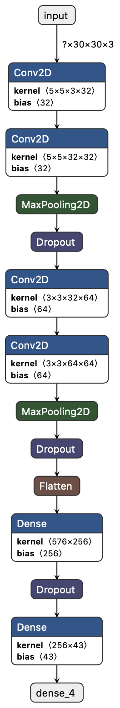
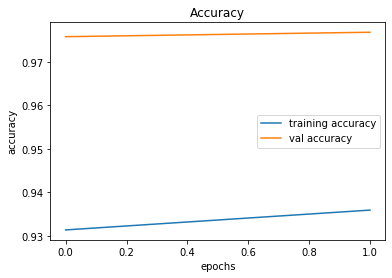
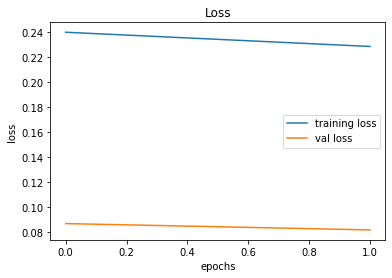
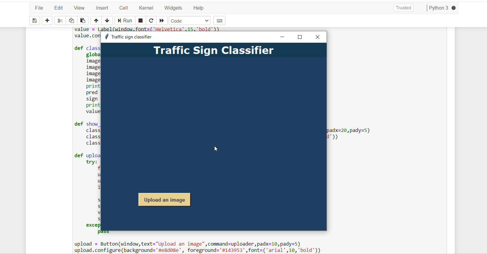

# **Traffic Signs Recognition and Classify using Deep Neural Networks**

*Puneet, Tanishq Chamola, Piyush Malhotra*

_CSE 6th semester, Chandigarh College of Engineering and Technology_

**Dataset** **-** https://www.kaggle.com/meowmeowmeowmeowmeow/gtsrb-german-traffic-sign

**Abstract** **-** Nowadays cars have become almost one of the most convenient transport modes for any household due to rapid growth in society and economy. This complicates the transport environment and people expect smart vision-assisted applications that provide drivers with information on signs of traffic, regulate drive operations or help with the control of vehicles to ensure road safety. The identification and analysis of traffic signals has become one of the most significant tasks of researchers. The primary purpose is to capture real-time road pictures using vehicle cameras and then identify and accurately provide the traffic signs encountered on roads. The road conditions are, however, very complex in the real world. The method of recognition has yet to be put into effect after several years of hard work and further study and development is still required. Traditionally, the use of traditional computer vision techniques has been observation and classification, but the processing of essential image features by human takes time. In order to solve this problem, more and more researchers use deep learning technology as science and technology develops and advances. The principal reason that the method of deep learning is widely accepted is that the model can autonomously learn the deep characteristics of the image from the samples.

# **1. Introduction**

Road signs are signs on or above the road providing directions or notifications to road users. In the road traffic network, traffic signals hold a significant role. The main function of the road signs is to show the contents that must be observed in the current section of the road, to prompt the drivers on the road to the danger and environmental difficulties, to advise the driver to drive at speed and to give a safe driving guarantee. Consequently, traffic sign detection and identification is a very important research approach, and it is important to avoid road accidents and to protect drivers&#39; personal safety.

Road traffic signs are divided into two major categories of main signs and auxiliary signs. Traffic signs are often designed to be a particular shape and color in order to enable drivers to easily read and recognize them with inside symbols, so that the traffic signs and background are significantly different. For instance, the speed limit 60 is a circular type with a strong &quot;60&quot; number. These characteristics are also critical for the identification of traffic sign systems. However, the recognition of traffic signs isn&#39;t an easy task as many adverse factors such as bad weather, change in viewpoint, physical damage, etc.

With the advancement of smart automotive technology, prominent car companies such as Mercedes-Benz, BMW, and others have actively invested in ADAS(Advanced Driver-Assistance System) research. Advanced driver support systems are systems which are developed to automate, adapt and improve the safety and driving of vehicles. Through minimizing the human mistake, the automated system offered through ADAS to the vehicle has proven to reduce road accidents. Safety features are designed to prevent crashes and injuries through the provision of technology that warn the driver to problems or prevent collisions through the implementation of vehicle safeguards. The software has an ability to automate lighting, collision avoidance, pedestrian crash mitigation, alert driver, view blind spots, traffic alert, lane departure warning and automatic lane centering, or smartphones for navigation instructions.

# **2. Materials and methods**

This section discusses the dataset used along with its preprocessing and method used in the research study.

## **2.1. Dataset**

The dataset collected from the German Traffic Sign Benchmark single-image classification challenge held at the International Joint Conference on Neural Networks (IJCNN) 2011, has been used in the proposed work. The dataset initially consisted of more than 35,000 images in total which has been divided into 43 classes. These classes represent the different types of traffic signs.

| **Category** | **Task** | **Number of images** |
| --- | --- | --- |
| Training Data | Used to train the network | 31367 |
| Testing Data | Used to evaluate the final network | 7842 |

##

## **2.2. Data Preprocessing**

The steps used to prepare data for the proposed work has been discussed in detail below.

## **2.2.1. Data Cleaning**

The collected dataset was manually filtered to remove low quality, blurred or partially obscured images. The resulting images after data cleaning process were 39209 in number.

**2.2.2. Resizing of Images**

The resulting images after data cleaning were uniformly resized to 3030 pixels before training the model effectively. This was done because sequential models perform better on square images of similar sizes.

## **2.3. Convolutional Neural Networks**

Convolutional neural networks have proved to be efficient when using matrices to deliver good images. CNN consists of a pipeline of convolutionary layers which are pooled and completely connected. Convolution layer extracts key features from an image input and forms a map. The spatial relationship of the image pixels is preserved through this feature map. Input images with various kernels (filters) lead to the learning of trivial features such as edges and complex features such as patterns. Pooling Layer reduces the size of convolutionary characteristics maps by extracting only dominant features. The linear rectified (ReLU) unit is used for introduction of CNN non-linearity. CNN finally has one or more fully connected layers that are used to input flattened matrix values. In applications such as image classification, functional and object detection, CNN has been successfully applied in images, enabling them to form the basis for computer vision applications.

## **2.4. Model**

The model used in this project is a sequential model. The architecture of the CNN model the proposed work has been discussed as follows:

1. Conv2D – A convolution is used for feature extraction. It extracts the different features at different layers with the help of the filters. The first conv2d layer uses 32 filters and the kernel size of 5 x 5 and ReLU activation function. The output of ReLU is max(0,x). Then another identical Conv2D layer is applied again.
2. MaxPool2D – Max pooling is used to reduce the dimensions of the image. This is helpful in reducing the computation power required to process the image. The model uses a pool size of (2,2) which means it will select the maximum value of each 2 x 2 area and the dimensions of the image will reduce by a factor of 2.
3. Dropout – Next we insert dropout layer. It is used to prevent overfitting and reduces the complexity of the model. The model uses dropout rate as 0.25 which means 25% of neurons are removed randomly.
4. Conv2D, MaxPool2D, Dropout – In the next step these three layers are applied again for better training and performance of our model. This time the model uses 64 filters instead of 32 and a kernel size of 3 x 3 instead of 5 x 5, as used in previous steps.
5. Flatten- The flatten layer transforms the 2-D data into a long 1-D vector of features for a fully connected layer that can be fed into the neural network.
6. Dense – We use dense layer as a output layer. The last layer of a network is dense layer. It outputs 43 nodes as the traffic signs have been divided into 43 categories in the dataset. The last layer uses softmax activation function which gives the probability value (between 0 and 1) so that the model can predict which of the 43 options has highest probability.

# **3. Results and Discussion**

In this project, the model created was used to classify the traffic signs. Various parameters used to train the model have been listed out in Table 1.

| **Parameters** | **Value** |
| --- | --- |
| **Convolution Layers** | 12 |
| **Number of Epochs** | 2 |
| **Batch Size** | 32 |
| **Train - Test Split** | 80:20 |
| **Image Size** | 30 x 30 |
| **Total categories** | 43 |
| **Total images** | 39209 |
| **Training dataset size** | 31367 |
| **Test dataset size** | 7842 |
| **Kernel** | 5 x 5 for convolution layers |
| **Activation** | ReLU for convolution layers |
| **Loss function** | categorical\_crossentropy |

_Table 1. Parameters used for the model_

The architecture of the model is shown in Figure 1. The architecture consists of convolution layers to classify the traffic signs.

_Figure 1. Model Architecture_

Figure 2 shows training accuracy and validation accuracy per epoch and Figure 3 presents training as well as validation loss per epoch, when all the layers of the network were trained.

_Figure 2. Training and Validation accuracy per epoch_

_Figure 3. Training and Validation loss per epoch_

The results obtained by the model have been displayed in Figure 4. While there is a definite scope for improvement, however, the model gives reasonably good results.

# **4. Conclusion**

This project presented a convolutional neural network implementation used for traffic signs classification. The applied methodology has shown significant result with an average validation accuracy of 97.63% and an average training accuracy of 93.36%. As further work, the application could be optimized by implementing an embedded hardware for use in active applications.
